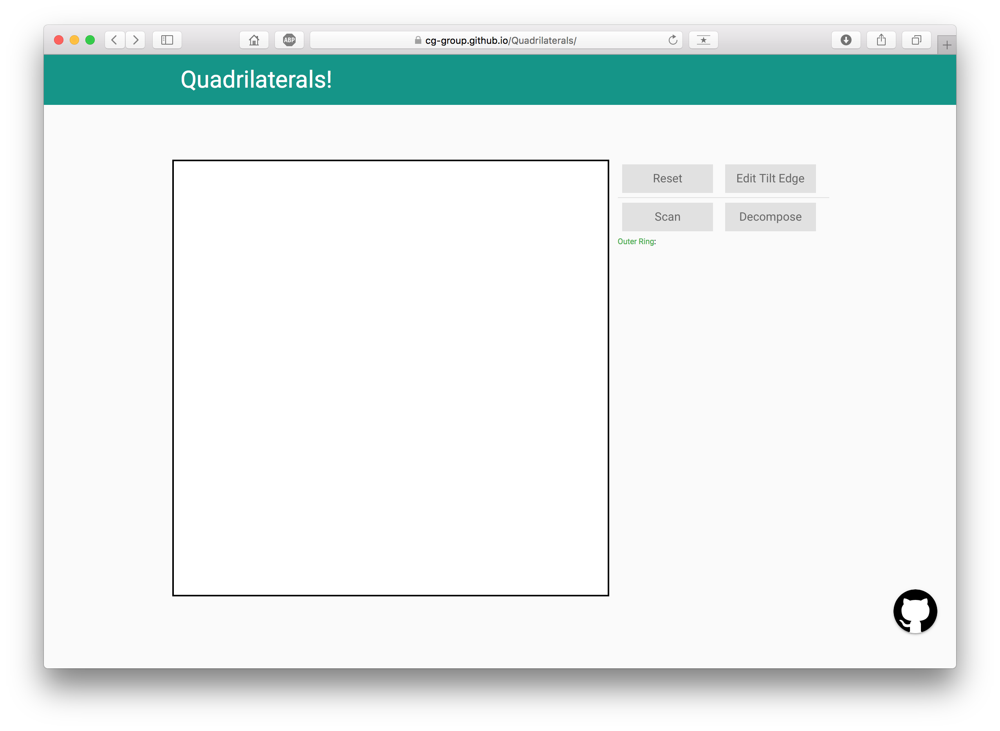

## 用户手册

[TOC]

### 1. 运行环境及启动方法

打开源代码目录下的`index.html`或访问[https://cg-group.github.io/Quadrilaterals/](https://cg-group.github.io/Quadrilaterals/)即可启动(推荐使用Chrome或Safari浏览器)。

界面如图所示:

### 2. 概述

### 3. 添加多边形

#### 3.1 添加正交多边形 

正交多边形指的是各条边要么水平、要么垂直的多边形。

#### 3.2 调整倾斜边

### 4. 分解多边形 
