## 用户手册

[TOC]

### 1. 运行环境及启动方法

打开源代码目录下的`index.html`或访问[https://cg-group.github.io/Quadrilaterals/](https://cg-group.github.io/Quadrilaterals/)即可启动(推荐使用Chrome或Safari浏览器)。

界面如图所示:

### 2. 概述

### 3. 添加多边形

#### 3.1 添加正交多边形 

正交多边形指的是各条边要么水平、要么垂直的多边形。例如，下图即为一个包含两个内环的正交多边形:  

页面左侧的正方形区域为绘图区，在此区域单击鼠标将开始创建多边形的外环。接下来，移动鼠标，将如下图出现绿色参考线。此时单击鼠标，将在绿色方形处创建第二个顶点。第一条边可能是水平的或是垂直的:  
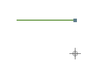
如果第一条边是水平的，那么第二条边必须是垂直的:  
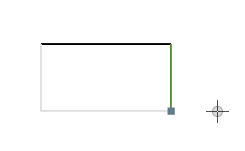
在创建正交多边形的过程中，单击鼠标右键可封闭当前环。灰色参考线展示了环封闭后的形状。程序在封闭环时将根据当前已有边数是奇数还是偶数采取不同的处理，如上图(奇数)、下图(偶数)所示:  
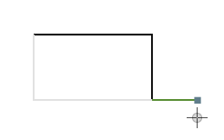
如果当前环无法直接封闭，那么封闭环的参考线将由灰色变成浅红色:  
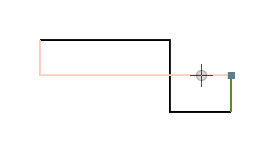
如果当前鼠标位置无法添加新顶点，那么添加顶点的参考线将由绿色变成红色:  
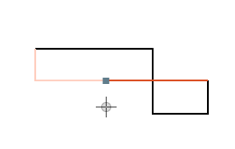
右键单击鼠标，封闭当前环:  
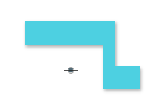
添加内环的方法与绘制外环方法类似。第一个顶点需要在多边形内部单击。绘制过程中，顶点不可超出多边形区域:  
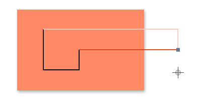
也不可使环自相交:  
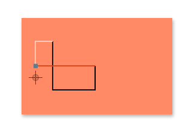
添加内环后的效果如图:  
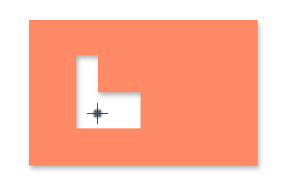

#### 3.2 调整倾斜边

伪正交多边形的定义比正交多边形宽松一些，除水平边外，不限制其余边是垂直的，允许"倾斜边"的出现，同时满足如下条件:

* 各个内角均不大于270°;
* 水平边与倾斜边交替出现;
* 将所有顶点投影在$x$轴上，那么倾斜边投影得到的线段内不包含其他顶点的投影。

如下图所示:  
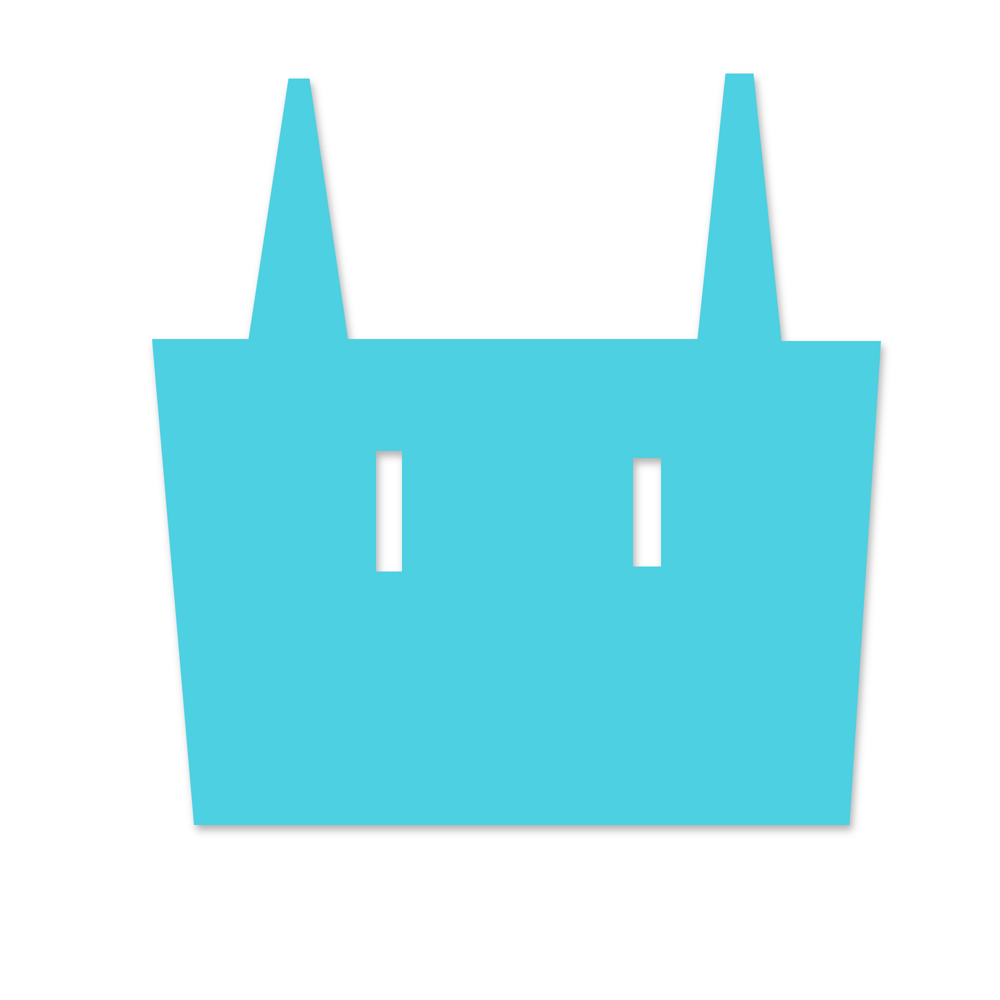
我们的程序允许在添加完正交多边形后，编辑多边形中的垂直边。按下空格或点击右上角"Edit Tilt Edge"按钮，将进入倾斜边编辑状态，此时该按钮将被激活，绘图区中将显示多边形的各个顶点。单击一个顶点，便可以开始移动此顶点:  
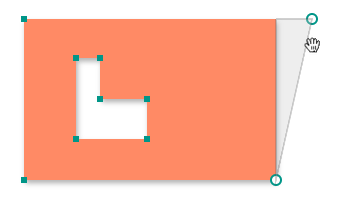
预览三角形呈灰色表示移动至该位置合法，红色则表示非法:  
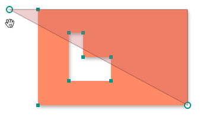
单击鼠标左键将确认移动顶点，单击鼠标右键或按下ESC将取消此次移动:  
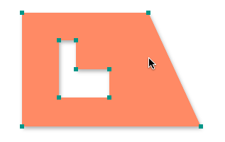

### 4. 分解多边形 

添加完多边形后，点击"Scan"按钮，绘图区将出现从左至右移动的垂直扫描线。扫描线扫过各个顶点后，将计算各个顶点的"右邻居"。如下图所示，具有右邻居的顶点将与其右邻居连接一条由蓝色渐变至黄色的线段:  
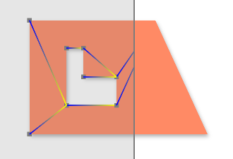
单击"Decompose"按钮，将开始四边形分解。分解每个四边形时，将首先找到一条"left edge"，再找到该left edge的一个端点的右邻居，再找到与该右邻居相接的顶点。将这四个顶点顺次连接便是一个分解出的多边形:  
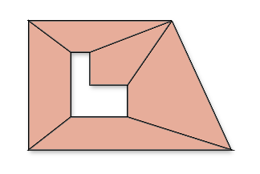
