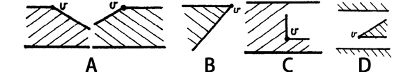

## 伪正交区域的凸四边形分解算法的实现与可视化

### 问题介绍

#### 概念简介

多边形区域指的是平面上的一个封闭区域，它的边界是多边形，内部可以有一些多边形洞。多边形区域的顶点或边是边界多边形与孔洞多边形上的顶点或边。多边形的弦指的是区域内部连接两个顶点的线段。将一个多边形区域分解成多个四边形意味着添加弦，由于添加的弦任意两条都不相交，所以由弦和边组成的最小区域就是四边形。

将多边形区域分割成凸四边形是一个 NPC 问题。对于没有洞的多边形，情况简单一些，可以用一个多项式时间动态规划算法剖分。并且，当每个凸四边形有一个权重(由多边形边、弦确定)的时候，剖分算法还能给出权值和最小的划分方式。

正交多边形区域（rectilinear regions）指的是所有的边都是水平的或者垂直的；正交区域指的是一个边界多边形与孔洞多边形都是正交的。

伪正交区域（pseudo-rectilinear region）：

* 水平边和倾斜边交替出现
* 所有内角不大于270°
* 任意倾斜边的影子都不包含顶点(边e的影子: 是一个区域，这个区域里每个点都能与e上(端点不算)的某个点垂直连起来，且连线在多边形内)

#### 选题介绍

我们这次项目的选题为伪正交区域的凸四边形剖分，主要参考了 [Lubiw] 和 [KKK] 这两篇论文。在 [KKK]  这篇论文中证明了正交多边形区域能够被分解成凸四边形。[Lubiw] 在 [KKK]  这篇文章的基础上提出了新的工作，展示了两个多边形区域类 $P_1$ 和 $P_2$ ，它们是"CQ hereditary"的[^1]：

[^1]: "CQ hereditary"的定义是: 一个多边形区域类 $P$ ，对于其内部的一个多边形区域，如果它本身不是凸四边形，那么它有一个"可移除的四边形"，"可移除的四边形" 指的是区域中的凸四边形，它的边是区域的边或者弦，移除了它区域仍属于这一类多边形区域中。显然，CQ hereditary类里面的每个多边形区域都是可以被分解成凸四边形的。

*  $P_1$ ：1-正交多边形区域
*  $P_2$ ：伪正交多边形区域

由于 $P_2$ 类多边形区域的凸四边形分解更具有普适性，因此我们这次项目主要实现 $P_2$ 类多边形区域分解算法的实现与展示。在算法的时间复杂度方面，对于包含 $n$ 个顶点的 $P_2$ 区域，可以在 $O(nlogn)$ 时间内分解成多个凸四边形。特别地，当这个区域是正交区域时， $O(nlogn)$ 是下界。

### 相关工作

将多边形区域分解成简单多边形区域在计算几何领域是一个很重要的问题，这个问题可以应用在计算机图形学、模式识别、以及VLSI设计 [T] 。简单多边形区域指的是有很少的顶点，如三角形或者四边形等；或者有一些独特的结构，如凸性、单调性、星形等；又或者是前两者的组合。

*  [S] 利用 [KKK] 证明，给出了 $O(nlogn)$ 的算法，可以分解正交无洞多边形。
*  [GJPT] 提出 $O(nlogn)$ 算法，将 $n$ 个顶点的无洞区域分解成多个三角形
*  [K] 提出一个多项式时间算法能够将没有洞的多边形区域分割成最小数目的正交多边形，同时证明如果有洞，那么这个问题是NP-hard的。

分解的另一种概念是“Steiner  decomposition”，在这种分解中，添加弦之前，会在区域的内部或者边界加入新的点。相关的工作有：

*  [PLLML] 能够在多项式时间内找到一个“Steiner  decomposition”，将正交多边形区域分解为最少的矩形
*  [LPRS]  能够在多项式时间内找到一个“Steiner  decomposition”，将没有洞的正交多边形区域分解为矩形，同时添加的线段长度总和最小，并证明如果有洞，则是NP-hard。
*  [CD]  能够在多项式时间内找到一个“Steiner  decomposition”，将没有洞的多边形区域分解为最少的凸多边形。 [Ln] 证明如果有洞的话，这种分解是NP-hard的。

 [KKK] 之所以想证明正交多边形区域都可以分解，是为了证明： $n$ 顶点的无洞正交多边形区域里所有的点都可以被不超过  个顶点看到。应用到博物馆守卫问题（museum problem）中，就是只要用 守卫就能看守有着n面墙的博物馆。 [EOW] 给出了摆放这 个守卫的nlogn的算法。

### 实现途径

#### 算法介绍

实现中使用了扫描线技术。首先对节点按照 $x$ 坐标进行排序，时间为 $O(n log{n})$ 。一条垂直的扫描线从 $x=-\infty$ 扫描至 $x=\infty$ ，在每次遇到节点时暂停。在扫描的过程中，将遇到的边加到一个有序序列中。而这个序列需要支持 $O(logm)$ 复杂度的元素删减操作，其中 $m$ 为序列的长度。

当扫描线自底向上扫描时，边成对进入并成对离开，将其称为“进出对” (in-out pair)。假设节点 v 为扫描过程中下一个即将遇到的节点，那么节点 $v$ 有这样几种情况：A，位于一条边上；B，位于两条边上；C，位于一对“进出对”的边的中间；D，位于两条边中间，且这两条边属于不同的“进出对”。请看下图

一旦知道节点 $v$ 相对于当前边序列的相对位置，边的序列需要及时的更新。在C，D两种情况中，两条新边需要加入到序列中；在情况A中，一条边被替换；在情况B中，两条边被删除。

在情况A，B和C中，节点 $v$ 所两侧属于同一“进出对”的两条边可能为某些节点带来 initial right neighbour 。以一条右边与节点 v 连接的节点没有 initial right neighbour，而任何一个以一条左边与节点 $v$ 相连的节点可以继续等待一个 initial right neighbour。同时，在情况A，C和D中，节点 $v$ 自身也需要等待一个 initial right neighbour。

在扫描过程中，可以确认全部的左边，而这些左边也可以按照其右节点的 $x$ 坐标进行排序。

扫描过程的时间复杂度为 $O(n logn)$ 。

#### 系统框架

由于算法时间复杂度为 $O(n logn)$ ，效率很高，同时，用于展示的多边形节点个数并不大，因而将使用 JavaScript 实现算法及展示，可以避免服务器和前端的信息交互，较少不必要的延迟。

在前端的算法展示以及动画部分，计划使用 Canvas 实现。在交互方面， Canvas 实现起来尽管并不如 SVG 那样方便，但是可以实现更复杂的效果。

### 前端实现计划

#### 算法部分

基于 [Lubiw] 这篇论文所实现的扫描线算法，前端对算法细节的展示应包括算法的中间结果以及最终剖分结果中弦与边的位置关系。算法中比较关键的部分为 initial right neighbour 与扫描过程中构造的 in-out pair，在前端展示中，会使用相应的动画来突出这两部分的变化。

#### 交互部分

用户应能够简单、直观地构造 $P_2$ 多边形。 $P_2$ 多边形定义中对斜边位置的限制是较难处理的，如果将已经输入的边固定，那么新输入的边将受到诸多限制，容易使交互不连贯。因此初步考虑使用如下的输入方式:

首先用户只能输入正交多边形，即所有边均是横平竖直的。接下来用户可拖动调整每一条垂直边的两个顶点，以完成倾斜的过程，在此过程中，应时刻保证符合 $P_2$ 多边形的定义。

#### 动画部分

应支持:

- 用户单步执行算法中的步骤
- 显示/隐藏辅助线等

可以在算法执行过程中自动生成文字说明。

### 计划及分工

#### 成员

周伯威（2016213588）、潘毅铃（2016311947）、肖剑楠（2016213589）

| 任务        | 参与者         | 时间        |
| --------- | ----------- | --------- |
| 算法思路整理及讨论 | 肖剑楠、潘毅铃、周伯威 | 5.1-5.10  |
| 前端框架搭建    | 周伯威         | 5.5-5.10  |
| 用户输入交互实现  | 周伯威         | 5.11-5.15 |
| 算法实现、测试   | 肖剑楠、潘毅铃     | 5.11-5.31 |
| 交互、展示效果优化 | 周伯威         | 5.15-5.31 |

### 参考文献

[Lubiw] Lubiw, Anna. "Decomposing polygonal regions into convex quadrilaterals." Proceedings of the first annual symposium on Computational geometry. ACM, 1985.

[KKK] Kahn, Jeff, Maria Klawe, and Daniel Kleitman. "Traditional galleries require fewer watchmen." SIAM Journal on Algebraic Discrete Methods 4.2 (1983): 194-206.

[T] Toussaint, Godfried T. "Pattern recognition and geometrical complexity." Proceedings of the 5th International Conference on Pattern Recognition. Vol. 334. 1980.

[S] Sack, J., and O. An. "Algorithm for Decomposing Simple Rectilinear Polygons into Convex Quadrilaterals,"." Proceedings of the 20th Allerton Conference on Communication, Control, and Computing, Monticello. 1982.

[GJPT] Garey, Michael R., et al. "Triangulating a simple polygon." Information Processing Letters 7.4 (1978): 175-179.

[PLLML] Pagli, L., et al. "On two dimensional data organization 2." Fund. Inform 2 (1979): 211-226.

[LPRS] Lingas, Andrzej, et al. "Minimum edge length partitioning of rectilinear polygons." Proc. 20th Allerton Conf. Commun. Control Comput. 1982.

[CD] Chazelle, Bernard, and David Dobkin. "Decomposing a polygon into its convex parts." Proceedings of the eleventh annual ACM symposium on Theory of computing. ACM, 1979.

[Ln] Lingas, Andrzej. "The power of non-rectilinear holes." International Colloquium on Automata, Languages, and Programming. Springer Berlin Heidelberg, 1982.

[EOW] Edelsbrunner, Herbert, Joseph O'Rourke, and Emmerich Welzl. "Stationing guards in rectilinear art galleries." Computer vision, graphics, and image processing 27.2 (1984): 167-176.